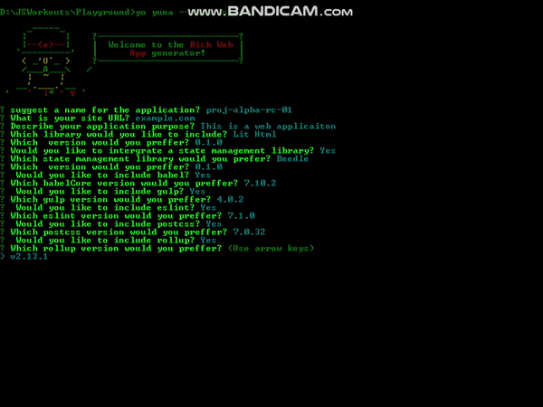

# Generator-Yuna

<!-- []() -->
<!-- []() -->


Universal generator(🌎) for all preliminary and advanced projects (batteries included)



# Table of contents

- [spell it](https://github.com/LasMD/generator-yuna#spell-it)
- [Install](https://github.com/LasMD/generator-yuna#install)
- [Usage](https://github.com/LasMD/generator-yuna#usage)
- [why yuna](https://github.com/LasMD/generator-yuna#why-yuna?)
- [features included](https://github.com/LasMD/generator-yuna#features-included)
- [Assumptions](https://github.com/LasMD/generator-yuna#assumptions)

  - [Database](https://github.com/LasMD/generator-yuna#database)

- [Apps inspired _yuna_](https://github.com/LasMD/generator-yuna#apps-which-inspired-to-create-_yuna_)
- [License](https://github.com/LasMD/generator-yuna#license)

## Spell It

yu-na -> spell ass **_yo-na_** not **_you-na_**. **Y**eoman **U**niversal ge**n**er**a**tor (YUNA). (it is a requirement of yeoman ecosystem to
include _generator_ prefix)

## Install

> Yuna requires several tools as dependancies listed in assumptions.

```
npm install -g yeoman
npm install -g generator-yuna
```

## Usage

> before running yuna, please make sure that the deployment folder is created with the name which will be giving to the application

```
yo yuna
```

## Why yuna?

The first impression get when a person reach _Yuna_ is why another generator ?
The main idea behind _yuna_ is to make it more simpler and less fuzzie generator at all. If you consider more advanced tools, what can observer is complexity. herewith yuna, brings more simpler and robust scaffolding system.

There are more general webapp scaffolding apps listed on (Yeoman site) [yeoman-generators], you can find on visiting the site.

Here are features included in _yuna_ script.

## features included

- programatic, prioritized, and intelligent dependancy mangement to the generated project
- comprehensive
- Exetendable
- important tools included (`gulp`, `sass`, `babel`, `postcss`, `browser-sync`, `sourcemaps`, `eslint`, etc.)
- git configuration included and pre configured.
- minimal server side PHP scripts included with security hardened (more languages will be supported in the future ex: `js`, `ruby`, `java`)
- support to multiple builders and bundlers (`gulp`, `rollup`)
- depoloy script included to support local deployment (deploy.bat) using \*AMP stack (windows only)

visit [docs](yuna-wiki) for more

## Assumptions

- The plugin runs on windows (because of deploy.bat)
- MYSQL database client installed and configured
- Local dev server is WAMP
- Nodejs and git installed and configured
- `SERVER_ROOT` env is set to point to local deploy location

### Database

yuna assumes MySQL database client was installed and below enironment variables configured.

- `MYSQL_DATABASE` to point to database name
- `MYSQL_USER` to point to current database client user
- `MYSQL_PASSWORD` listing the user password

(please feel free to change the respective envars according to the client used to
develop the application)

## Apps which inspired to create _yuna_

making of _Yuna_ inspired by 2 of the most amazing repos available on github 😎
[generator-webapp](generator-webapp)
[generator-union-webapp](generator-union)

## License

MIT

© [contact me](linkedin.com/in/lasithadenipitiya)

<!-- liks to references -->

[yeoman-generators]: https://yeoman.io/generators/

<!-- github references -->

[yuna-wiki]: https://github.com/LasMD/generator-yuna/wiki
[generator-union]: https://github.com/unionco/generator-union-webapp/tree/master/app/templates
[generator-webapp]: https://github.com/yeoman/generator-webapp
